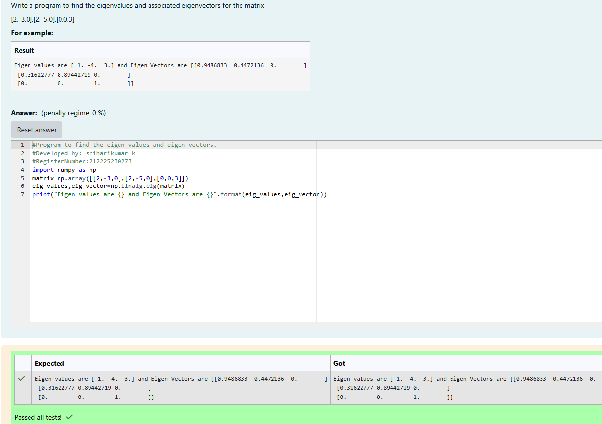

# EIGENVALUES-AND-EIGENVECTORS
## Aim:
To write a python program to find the Eigenvalues and Eigen Vectors
## Equipment’s required:
1. 	Hardware – PCs
2. 	Anaconda – Python 3.7 Installation / Moodle-Code Runner
## Algorithm:
### Step1 : start the program by importing library as np
### Step 2: give the matrix value and store that in variable matrix
### Step 3: Using the np.linalg.eig(),  we get two results (first is eigenvalue and second is eigenvector) of the given matrix.
### Step 4: print the output

## Program:
```
#Program to find the eigen values and eigen vectors.
#Developed by: sriharikumar k
#RegisterNumber:212225230273
import numpy as np
matrix=np.array([[2,-3,0],[2,-5,0],[0,0,3]])
eig_values,eig_vector=np.linalg.eig(matrix)
print("Eigen values are {} and Eigen Vectors are {}".format(eig_values,eig_vector))
```

## Output:

## Result:
Thus the Eigenvalue and Eigenvector is successfully solved using python program
